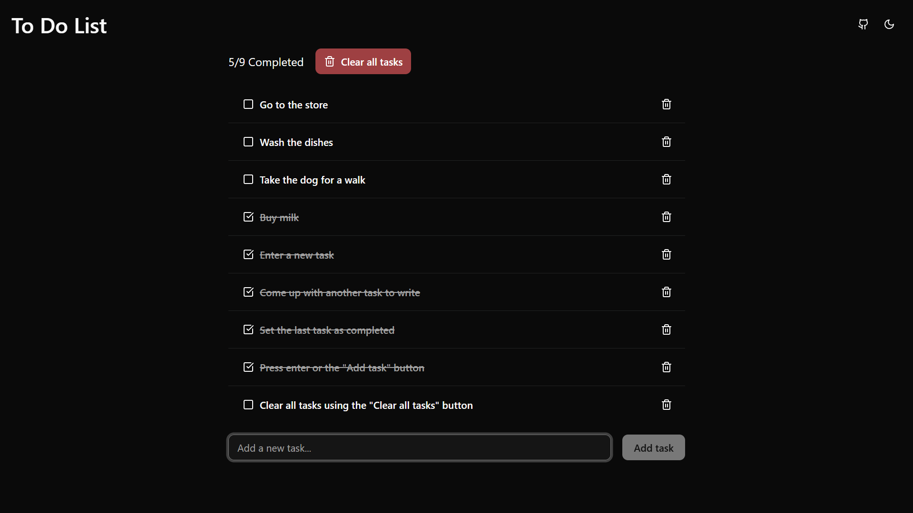

<div align="center">
  <h3>To Do List App</h3>
  <p>A to do list web application built with SvelteKit and MongoDB</p>
</div>

<details>
  <summary>Table of Contents</summary>
  <ol>
    <li>
      <a href="#about">About</a>
      <ul>
        <li><a href="#built-with">Built With</a></li>
      </ul>
    </li>
    <li>
      <a href="#getting-started">Getting Started</a>
      <ul>
        <li><a href="#prerequisites">Prerequisites</a></li>
        <li><a href="#installation">Installation</a></li>
      </ul>
    </li>
    <li>
      <a href="#usage">Usage</a>
        <ul>
          <li><a href="#screenshot">Screenshot</a></li>
          <li><a href="#features">Features</a></li>
        </ul>
    </li>
    <li><a href="#license">License</a></li>
    <li><a href="#contact">Contact</a></li>
  </ol>
</details>

<!-- ABOUT -->

## About

It’s a todo list app. What more is there to know?

Built as a learning project using SvelteKit, MongoDB, and Docker. It covers basics like form handling, API routes, database integration, and containerized deployment.

<p align="right"><a href="#top">Back to Top</a></p>

<!-- BUILT WITH -->

### Built With

- [](https://svelte.dev/)
- [](https://svelte.dev/)
- [](https://www.mongodb.com/)
- [](https://www.typescriptlang.org/)
- [](https://vite.dev/)
- [](https://tailwindcss.com/)
- [](https://www.shadcn-svelte.com/)

<p align="right"><a href="#top">Back to Top</a></p>

<!-- GETTING STARTED -->

## Getting Started

<!-- PREREQUISITES -->

### Prerequisites

- npm

  ```bash
  npm install npm@latest -g
  ```

<!-- INSTALLATION -->

### Installation

1. Clone the repository

   ```bash
   git clone https://github.com/natebabyak/to-do-list-app.git
   ```

2. Create and configure `.env`

   ```bash
   MONGODB_URI=YOUR_MONGODB_URI
   ```

3. Install dependencies

   ```bash
   npm install
   ```

4. Start the local development server

   ```bash
   npm run dev
   ```

5. Open in your browser

   ```bash
   http://localhost:5173
   ```

<p align="right"><a href="#top">Back to Top</a></p>

<!-- USAGE -->

## Usage

### Screenshot



<p align="right"><a href="#top">Back to Top</a></p>

### Features

- Create tasks
- Read tasks
- Update tasks
- Delete tasks

<p align="right"><a href="#top">Back to Top</a></p>

## License

Distributed under the MIT License. See [`LICENSE.txt`](https://github.com/natebabyak/to-do-list-app/blob/main/LICENSE.txt) for more information.

<div align="right"><a href="#top">Back to Top</a></div>

<!-- CONTACT -->

## Contact

- [](https://github.com/natebabyak)
- [](nate.babyak@outlook.com)

<div align="right"><a href="#top">Back to Top</a></div>
